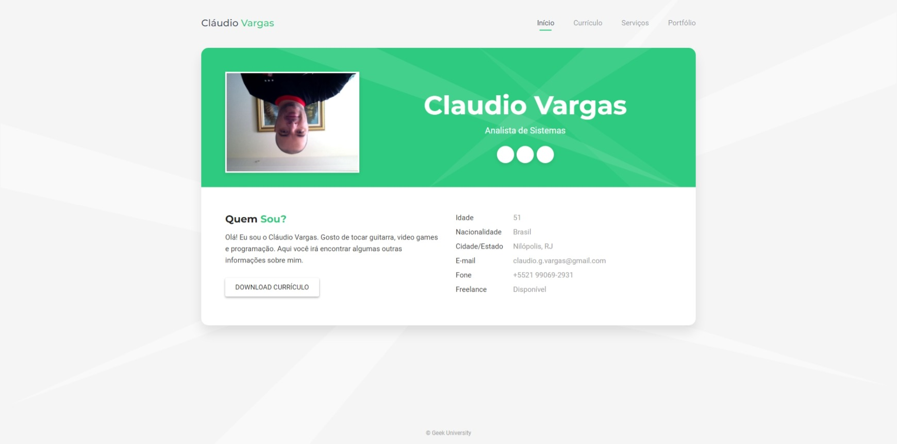

# Nome do projeto
> Um resumo curto sobre o que o projeto faz. (2 linhas no máximo)

Um ou dois parágrafos sobre o projeto e o que ele faz.

---



---

## Instalação

OS x & Linux:

```sh
npm install --save
```

Windows:

```sh
edit autoexec.bat
```
---

## Exemplo de uso

Alguns exemplos que motivariam as pessoas a utilizarem seu projeto ou que 
demonstrasse que este é útil para alguma coisa. Dívida esta parte em partes
menores e se possível coloque algum código ou prints de telas.

---

## Ambiente de desenvolvimento

Descrever como instalar e preparar qualquer dependencia de desenvovimento
para que seu projeto possa ser executado localmente e pessoas possam contribuir
com o mesmo. Se possível forneça as informações para diferentes plataformas, 
exemplo Windows, Linux e Mac OS.

---

* 0.2.1
    * CHANGE: Atualçização dos docs (o código não foi alterado)
* 0.2.0
    * ADD: Adicionado a função `setPadrãoXYZ()`
* 0.1.1
    * FIX: Crash quando executa `escrever ()` (Obrigado ao @Contribuidor)
* 0.1.0
    * O promeiro lançamento estável
    * CHANGE: Renomeado de `Projeto XYZ`
    para `Projeto ABC`

---

## Meta

Seu nome - [@SeuTwiter](https://twitter.com/seuTwiter) - seuemail@gmail.com
Distribuido sobre licença. 

Veja `LICENÇA` para mais informações.

[https://github.com/seuusuario/seuprojeto]

(https://github.com/seuusuario)


